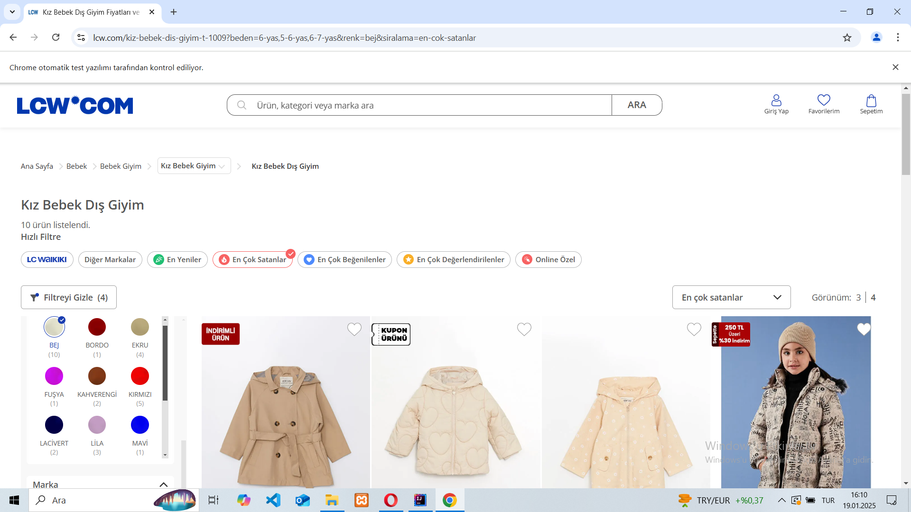
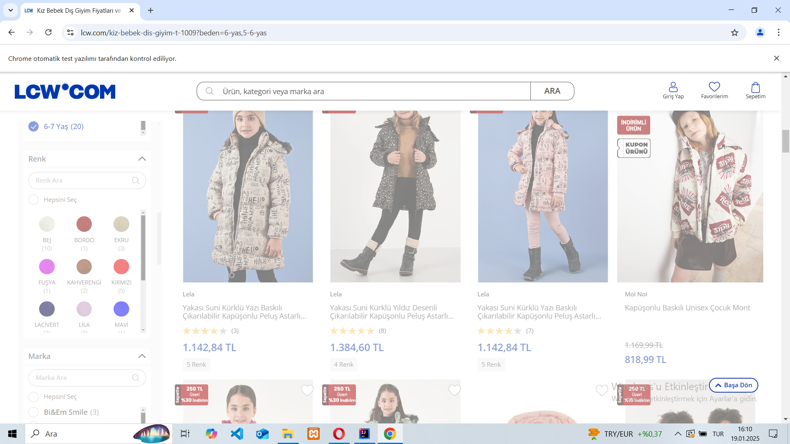

# LCW-Bootcamp-Final-Case

LC Waikiki Yazılım Test Uzmanlığı Bootcamp Final Case

## Proje Hakkında

Bu proje, LC Waikiki web sitesi üzerinde bir otomasyon testi gerçekleştirmeyi amaçlamaktadır. Proje kapsamında kullanıcı senaryoları belirlenmiş ve bu senaryoların otomasyonu **Selenium**, **Java** ve **TestNG** kullanılarak gerçekleştirilmiştir. Proje, **POM (Page Object Model)** tasarım desenine uygun olarak yapılandırılmış ve raporlama için **Allure Report** kullanılmıştır.

---

## Kullanılan Teknolojiler ve Detayları

### 1. **Java**
Java, bu projede ana programlama dili olarak kullanılmıştır. Nesne yönelimli bir dil olması, geniş kütüphane desteği ve Selenium gibi test otomasyon araçlarıyla uyumlu çalışması tercih sebeplerindendir.

- **Java 11 veya üstü** tercih edilmiştir.

### 2. **Selenium WebDriver**
Selenium, web tarayıcıları üzerinde otomasyon yapmak için kullanılan açık kaynaklı bir araçtır. Bu projede:
- **Web sayfası elementlerine erişim** ve **onlarla etkileşim** sağlanmıştır.
- WebDriver'ın **ChromeDriver** sürücüsü kullanılmıştır.

### 3. **TestNG**
TestNG (Test Next Generation), test senaryolarını daha esnek ve düzenli bir şekilde yazmak ve yönetmek için kullanılan bir test çerçevesidir. Bu projede TestNG şu amaçlarla kullanılmıştır:
- Testleri gruplandırmak ve sınıflandırmak.
- Test metodları için **öncelik (priority)** ve **bağımlılık (dependency)** tanımlamak.
- Raporlama ve hata ayıklama işlemleri.

### 4. **Maven**
Maven, Java projeleri için proje yönetim aracıdır. Bu projede Maven:
- Proje bağımlılıklarının yönetimi (Selenium, TestNG, Allure Report).
- Projeyi derleme ve çalıştırma işlemleri için kullanılmıştır.

### 5. **Allure Report**
Allure Report, test sonuçlarını görselleştiren bir raporlama aracıdır.
- Testlerin geçiş durumu, hata detayları ve test adımları gibi bilgileri detaylı bir şekilde sunar.
- Test süreci ve sonuçlarını kolayca analiz etmek için kullanılmıştır.

### 6. **Page Object Model (POM)**
POM, test otomasyonu projelerinde kullanılan bir tasarım desenidir. Proje kodlarını daha düzenli ve yeniden kullanılabilir hale getirir. Bu projede her web sayfası için ayrı bir sınıf (Page) tanımlanmış, tüm işlemler ilgili sınıflar üzerinden yapılmıştır.

---

## Kurulum

### 1. Gereksinimler
- **Java 11 veya üstü**
- **Maven**
- **ChromeDriver** (Google Chrome sürümünüzle uyumlu)
- **Allure Commandline** (Raporlama için)

### 2. Maven Bağımlılıkları
pom.xml dosyasına bağımlılıkları eklemeniz gerekmekteir.

## Test çalışırken çekmiş olduğum bazı resimler 

